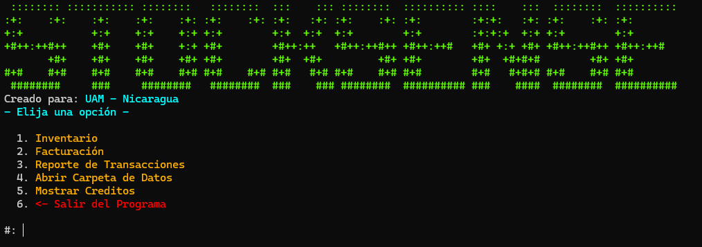
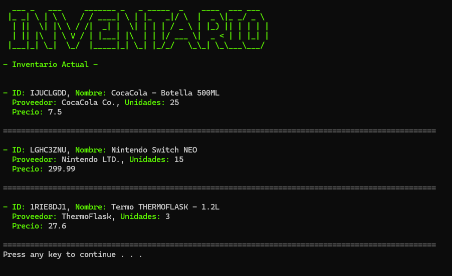
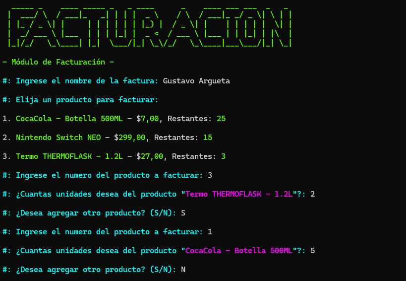
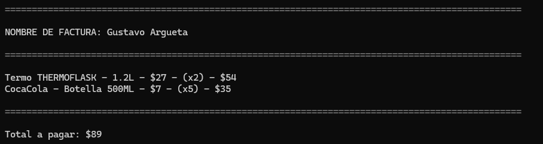
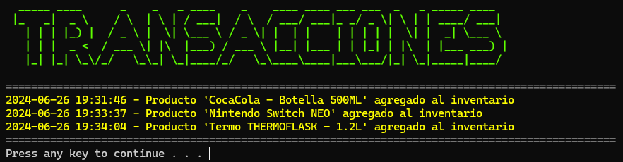
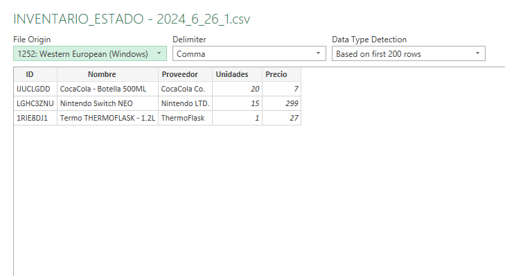
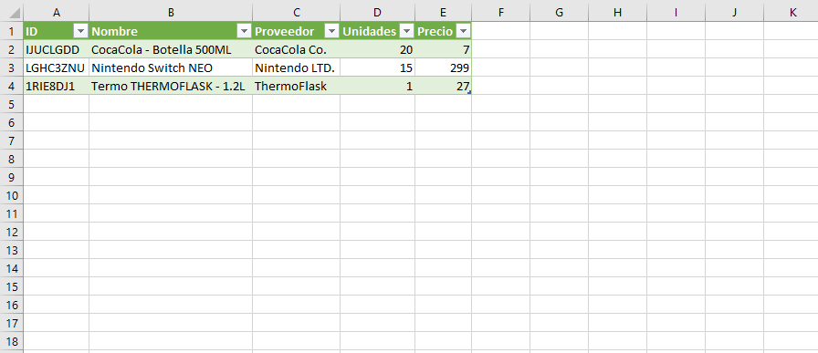

<h1> StockSense </h1>

  
  
  

StockSense es una **aplicación integral de código abierto** diseñada para simplificar y **optimizar la gestión de inventarios y facturación**. StockSense ofrece una solución completa para **mantener el control de los productos, gestionar transacciones y generar reportes detallados**. Es ideal para negocios que buscan eficiencia y precisión en sus operaciones diarias.

 

## *Tabla de Contenidos:*
- [**Modulos**](#modulos)
  - [Inventario](#inventario)
  - [Facturación](#facturación)
  - [Reporte de Transacciones](#reporte-de-transacciones)
  - [Exportación a CSV](#exportación-a-csv)
- [**Tecnologías Usadas**](#tecnologías-usadas)
  - [*VSCode*](#vscode)
  - [*C y C++*](#c-y-c)
- [**Disponibilidad**](#disponibilidad)
- [**Uso / Compilacion**](#uso--compilacion)
- [Créditos](#créditos)

 
 

# **Modulos**

StockSense tiene distintos modulos que ayudan al usuario a manejar y facturar su inventario de manera eficiente y a la vez llevar constancia del progreso y transacciones ocurridas.

## Inventario

El módulo de Inventario de StockSense **permite a los usuarios agregar y remover objetos** de manera sencilla. Además, **es posible editar atributos de los objetos**, como nombre, proveedor, precio y unidades. Este módulo también **proporciona una vista actualizada del inventario**, asegurando que siempre se tenga información precisa sobre los productos disponibles.

## Facturación

El módulo de Facturación está **automáticamente conectado con el sistema de inventario**, facilitando la facturación de múltiples objetos. Este módulo **calcula el subtotal por cada objeto y el total final**, haciendo que el proceso de facturación sea rápido y sin errores. La integración con el inventario garantiza que **la información de los productos siempre esté sincronizada**.

## Reporte de Transacciones

El módulo de Reporte de Transacciones de StockSense **ofrece un registro detallado de las acciones realizadas en el inventario**, incluyendo fecha y hora exactas. Esto **permite un seguimiento preciso de todas las modificaciones y movimientos de productos**, proporcionando una transparencia total en la gestión del inventario.

## Exportación a CSV

El módulo de Exportación a CSV **permite exportar los estados de inventario** a un archivo CSV, que **puede ser leído en aplicaciones como Excel**. Además, las facturas generadas se exportan automáticamente a CSV, **facilitando el análisis** y la documentación de las transacciones realizadas.
 
 
 

# **Tecnologías Usadas**

## *VSCode*

En el desarrollo de StockSense, VSCode se ha empleado por su **flexibilidad**, amplia gama de extensiones y su **capacidad para integrarse fácilmente con diversas herramientas y lenguajes de programación**.

## *C y C++*

StockSense está desarrollado utilizando los lenguajes de programación **C y C++**. Estos lenguajes han sido elegidos por su **eficiencia y velocidad de ejecución**, lo que resulta esencial para una aplicación que maneja grandes volúmenes de datos y necesita operar con **alta precisión y rendimiento**.

 
 

# **Disponibilidad**

**StockSense está disponible exclusivamente para sistemas operativos Windows** ya que usa el Windows API <windows.h> para realizar ciertas operaciones, **nos plantearemos en el futuro portear StockSense a otros sistemas operativos** como macOS y Linux.

 
 

# **Uso / Compilacion**

Para usar StockSense usted **puede ejecutar los archivos binarios en el apartado de releases** (.exe) o puede **compilar StockSense por su cuenta** siguiendo estos pasos:

1. Descargar un compilador de **C/C++** como **tdm-gcc**
2. Descargar un editor de texto como **VSCode**, **Visual Studio**, **Sublime Text**, etc.
3. Clonar el repositorio
4. Compilar **mainFrame.cpp**
5. Ahora usted tiene StockSense compilado :+1:

 
 

# Créditos

- LemonpieGBS *(Sistema de Inventario y Coordinador del Proyecto)*
- eaguilar0705 *(Sistema de Facturación)*
- diegourbiaviles1 *(Sistema de Reporte de Transacciones)*
- OscarArnueroUAM *(Sistema de Exportación a CSV)*

**Agradecimientos especiales a:** Silvia Gigdalia Ticay López, la docente que nos acompaño durante el proyecto.